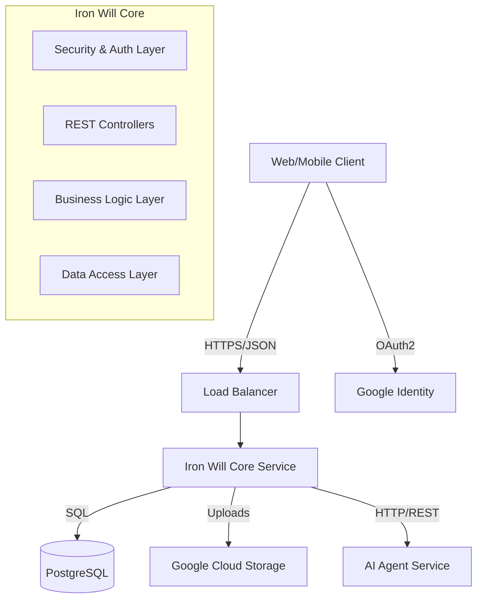

# Iron Will Core: Comprehensive Study & Architecture Guide

## Table of Contents
1. [Introduction](#introduction)
2. [Architecture Overview](#architecture-overview)
3. [Project Structure & Technology Stack](#project-structure--technology-stack)
4. [Configuration & Environment](#configuration--environment)
5. [Security & Authentication Deep Dive](#security--authentication-deep-dive)
6. [Data Domain & Persistence Layer](#data-domain--persistence-layer)
7. [Core Business Logic & Services](#core-business-logic--services)
8. [API Layer & Request Handling](#api-layer--request-handling)
9. [External Integrations: AI Agent & Cloud Storage](#external-integrations-ai-agent--cloud-storage)
10. [End-to-End Workflow Analysis](#end-to-end-workflow-analysis)
11. [Conclusion](#conclusion)

---

## 1. Introduction

Welcome to the **Iron Will Core Study Guide**. This document is designed for mid-level software engineers who wish to understand the inner workings of the "Iron Will" application backend. Whether you are onboarding to the team, auditing the system, or simply using this project as a learning resource for Spring Boot and Enterprise Java architecture, this guide will provide an exhaustive walkthrough.

"Iron Will" is an accountability and habit-tracking platform designed to help users achieve their goals through "social pressure" and gamification. The system allows users to define goals, submit daily proofs (images), and have those proofs verified by an AI Agent. The core backend handles user management, goal tracking, scoring (accountability score), and orchestrates the verification process.

This guide goes beyond simple code comments. It explains the *architectural decisions*, the *business rules* embedded in the code, and the *technologies* that power the platform. We will dissect the application layer by layer, starting from the configuration and security, moving down to the database entities, and then building up to the business services and API endpoints.

---

## 2. Architecture Overview

The Iron Will Core is built as a monolithic **Spring Boot** application. While "monolith" often carries a negative connotation in the age of microservices, for a core domain system like this, it provides simplicity, transactional integrity, and ease of deployment.

### 2.1 High-Level Diagram



### 2.2 Key Components

1.  **Core Service (This Repo)**: Acts as the "System of Record". It manages:
    *   **Users**: Profiles, authentication state, and accountability scores.
    *   **Goals**: Definitions of what a user wants to achieve, including frequency and criteria.
    *   **Audits**: The daily record of proof submissions and their results.
    *   **Orchestration**: It coordinates with the AI Agent to verify proofs.

2.  **PostgreSQL (Database)**: The relational database storing all persistent data. We use relational tables for structured data (Users, Goals) and JSONB columns for flexible data (Goal Criteria).

3.  **Google Cloud Storage (GCS)**: Used as an object store for proof images (photos uploaded by users).

4.  **AI Agent Service**: An external service (likely Python/FastAPI) that performs the computer vision and reasoning tasks to verify if a submitted photo meets the goal criteria.

### 2.3 Design Patterns Used

*   **Layered Architecture**: Controller -> Service -> Repository. This standard Spring pattern separates concerns:
    *   *Controllers* handle HTTP concerns (request parsing, response formatting).
    *   *Services* contain business logic (transactions, rules, scoring).
    *   *Repositories* handle data access abstraction.
*   **Inversion of Control (IoC)**: Spring's dependency injection is used throughout to manage component lifecycles and testing.
*   **Strategy Pattern**: (Implicitly used in Authentication handlers).
*   **Scheduled Tasks**: Background jobs (Cron) for proactive system actions (Nagging).

---

## 3. Project Structure & Technology Stack

### 3.1 Technology Stack

*   **Language**: Java 17 (LTS). Leverages records, text blocks, and modern stream APIs.
*   **Framework**: Spring Boot 3.2.5. The latest generation of Spring, supporting Jakarta EE 9/10 APIs.
*   **Build Tool**: Gradle (Kotlin DSL). A flexible and concise build configuration.
*   **Database**: PostgreSQL with `spring-boot-starter-data-jpa` (Hibernate) for ORM.
*   **Security**: Spring Security 6 with OAuth2 Client (Google Login) and JWT (JSON Web Tokens) for stateless session management.
*   **Utility**: Lombok (reduces boilerplate code like getters/setters/constructors).

### 3.2 Directory Structure

The codebase follows the standard Maven/Gradle directory layout:

```text
apps/core/
├── build.gradle.kts       # Build configuration and dependencies
├── src/main/java/com/ironwill/core/
│   ├── CoreApplication.java    # Main entry point (Bootstrapper)
│   ├── api/                    # REST Controllers (Web Layer)
│   │   ├── dto/                # Data Transfer Objects (Request/Response bodies)
│   ├── client/                 # External Clients (e.g., AgentClient)
│   ├── config/                 # Spring Configuration (CORS, Swagger, etc.)
│   ├── model/                  # JPA Entities (Database Tables)
│   ├── repository/             # Data Access Interfaces (Spring Data JPA)
│   ├── security/               # Auth logic (JWT, OAuth2 handlers)
│   └── service/                # Business Logic (The "Brain" of the app)
```

### 3.3 Dependency Analysis

Let's look at the `pom.xml` (or `build.gradle.kts` equivalent logic) to understand the capabilities:

*   `spring-boot-starter-web`: Includes Tomcat (embedded server) and Spring MVC.
*   `spring-boot-starter-security`: Provides the security framework.
*   `spring-boot-starter-oauth2-client`: Enables "Login with Google".
*   `spring-boot-starter-data-jpa`: Provides the repository abstraction over Hibernate.
*   `spring-cloud-gcp-starter-storage`: Google Cloud libraries for GCS integration.
*   `springdoc-openapi-starter-webmvc-ui`: Auto-generates Swagger/OpenAPI documentation.

---

## 4. Configuration & Environment

Configuration in Spring Boot allows the application to adapt to different environments (Local, Dev, Prod) without code changes.

### 4.1 Application Properties

The application relies on environment variables for sensitive or environment-specific data. This is a 12-Factor App best practice.

Key variables (found in `.env.example`):
*   `DB_URL`, `DB_USERNAME`, `DB_PASSWORD`: Database connection details.
*   `GCS_BUCKET`: The name of the Google Cloud Storage bucket.
*   `AGENT_BASE_URL`: The URL of the external AI Agent service.
*   `AGENT_INTERNAL_SECRET`: A shared secret key to authenticate *this* core service when it calls the Agent.
*   `JWT_SECRET`: The secret key used to sign and verify JSON Web Tokens.
*   `OAUTH_GOOGLE_CLIENT_ID` / `SECRET`: Credentials for Google OAuth2.

### 4.2 CORS Configuration (`CorsConfig.java`)

Cross-Origin Resource Sharing (CORS) is critical for allowing a frontend (running on a different domain, e.g., `localhost:3000` or `ironwill.app`) to call this backend.

The `CorsConfig` class defines a global policy:
*   It reads `app.cors.allowed-origins` from properties.
*   It allows standard HTTP methods (`GET`, `POST`, `PUT`, `DELETE`, `PATCH`, `OPTIONS`).
*   It sets `allowCredentials(true)`, which is necessary if we were using cookies (though we use headers mostly).

This configuration ensures that browsers don't block requests from our legitimate frontend application.

---

## 5. Security & Authentication Deep Dive

Security is the most complex part of the configuration. Iron Will uses a **Stateless** security model with **JWTs**, but bootstraps the user identity via **OAuth2 (Google)**.

### 5.1 The Authentication Flow

1.  **Frontend**: Redirects user to `/oauth2/authorization/google`.
2.  **User**: Logs in with Google.
3.  **Google**: Redirects back to the Core app.
4.  **Core (`OAuth2LoginSuccessHandler`)**:
    *   Intercepts the successful login.
    *   Extracts the email from the Google profile.
    *   Checks if the user exists in the DB.
    *   Generates a custom **JWT** (access token) representing the user's session in *our* system.
    *   Returns this JWT to the client (in JSON format).
5.  **Frontend (Subsequent Requests)**:
    *   Stores the JWT (e.g., in localStorage).
    *   Sends `Authorization: Bearer <token>` in the header for every API call.
6.  **Core (`JwtAuthenticationFilter`)**:
    *   Intercepts every request.
    *   Validates the token signature and expiration.
    *   Sets the `SecurityContext` if valid.

### 5.2 Key Classes

#### `SecurityConfig.java`
This is the "brain" of the security setup. It defines the `SecurityFilterChain`:
*   **CSRF Disabled**: Since we use stateless JWTs, Cross-Site Request Forgery protection (which relies on session cookies) is unnecessary and disabled to simplify the API.
*   **Session Policy**: `SessionCreationPolicy.STATELESS`. The server does *not* keep an HTTP session in memory. Every request must carry its own proof of identity (the JWT).
*   **Endpoint Rules**:
    *   `/auth/**`, `/oauth2/**`, `/health`, `/swagger-ui/**`: **PermitAll** (Public).
    *   `anyRequest()`: **Authenticated** (Locked).
*   **OAuth2 Setup**: Configures the `userInfoEndpoint` with our custom service and the `successHandler`.
*   **Filter Order**: Adds `JwtAuthenticationFilter` *before* the standard `UsernamePasswordAuthenticationFilter`.

#### `CustomOAuth2UserService.java`
This service extends the default Spring OAuth2 behavior.
*   **Purpose**: To perform "Just-In-Time" (JIT) provisioning.
*   **Logic**: When a user logs in with Google:
    1.  It loads the user info from Google.
    2.  It looks up the user by email in the `users` table.
    3.  **If not found**: It creates a new `User` entity, assigns the `ROLE_USER`, sets a default accountability score (5.0), and saves it.
    4.  **If found**: It updates the user (if needed) and proceeds.
*   **Result**: It returns an `OAuth2User` object that contains the user's authorities (Roles).

#### `OAuth2LoginSuccessHandler.java`
This handler runs *after* Google confirms identity and `CustomOAuth2UserService` has loaded/created the user.
*   **Logic**:
    1.  Retrieves the email from the authentication principal.
    2.  Loads the full `User` entity from the DB.
    3.  Calls `JwtService` to mint a new token containing claims (like roles).
    4.  Writes the token as a JSON response: `{"token": "..."}`.
*   **Note**: In a production web app, this might redirect to a frontend URL with the token as a query param, but returning JSON works for this API-centric design.

#### `JwtService.java`
Encapsulates all JWT operations.
*   **Signing**: Uses `HMAC-SHA256`. The secret key must be strong and kept safe.
*   **Generation**: Sets `Subject` (email), `IssuedAt`, `Expiration` (default 10 hours), and custom claims.
*   **Extraction**: Parses the token string to retrieve the user email (subject) for authentication.

#### `JwtAuthenticationFilter.java`
The gatekeeper for API requests.
*   **Logic**:
    1.  Looks for the `Authorization` header.
    2.  Parsing: Removes "Bearer " prefix.
    3.  Validation: Calls `JwtService.extractSubject()`.
    4.  User Loading: Calls `UserDetailsServiceImpl` to get the full user object.
    5.  Authentication: Creates a `UsernamePasswordAuthenticationToken` and places it in the `SecurityContextHolder`.
*   If this filter fails (invalid token), the request proceeds as anonymous, and `SecurityConfig` will likely deny it (403 Forbidden).

---

## 6. Data Domain & Persistence Layer

The data layer uses **JPA (Java Persistence API)** with Hibernate as the implementation. This allows us to map Java objects (Entities) directly to database tables.

### 6.1 Entity Relationship Diagram (Conceptual)

*   **User** (1) <---> (*) **Goal**
*   **User** (1) <---> (*) **Notification**
*   **Goal** (1) <---> (*) **AuditLog**
*   **User** (*) <---> (*) **Role**

### 6.2 Key Entities

#### `User.java`
Represents a registered user.
*   `id` (UUID): Primary key.
*   `email` (String): Unique identifier.
*   `accountabilityScore` (BigDecimal): **The most critical field.** Starts at 5.00.
    *   **Logic**: This score determines if the user is "locked out". It's a high-precision decimal to allow fine-grained adjustments (+0.5, -0.2).
*   `timezone` (String): Vital for calculating "end of day" logic for audits.
*   `roles` (Set<Role>): Many-to-Many relationship (User can be ADMIN and USER).

#### `Goal.java`
Represents a user's commitment.
*   `reviewTime` (LocalTime): The daily deadline or check-in time.
*   `frequencyType` (Enum): `DAILY` or `WEEKDAYS`. Defines *when* the goal is active.
*   `criteriaConfig` (JsonNode): **Flexible Schema**. Instead of hardcoding columns like "min_pages" or "calories", we store a JSON object. This allows the Frontend and Agent to agree on arbitrary validation rules without changing the DB schema.
*   `status` (Enum): `ACTIVE`, `LOCKED`, `ARCHIVED`. If `LOCKED`, the user cannot submit proofs.
*   `lockedUntil` (OffsetDateTime): If the user's score drops too low, their goals get locked until this timestamp.

#### `AuditLog.java`
The record of a specific day's attempt at a goal.
*   `goal` (ManyToOne): The parent goal.
*   `auditDate` (LocalDate): The specific date being audited.
*   `UniqueConstraint`: `uq_goal_date` ensures a user can only have *one* audit log per goal per day. This prevents duplicate submissions.
*   `proofUrl` (String): The GCS path (e.g., `gs://bucket/...`) to the image.
*   `status` (Enum): `PENDING` -> `VERIFIED` | `REJECTED` | `MISSED`.
*   `scoreImpact` (BigDecimal): Records exactly how much the score changed due to this audit (+0.5, -0.2, etc.).

#### `Notification.java`
Simple alert system.
*   `user`: Who receives it.
*   `message`: The text.
*   `read`: Boolean flag.
*   Used by the **NagScheduler** to remind users to submit proofs.

### 6.3 Repositories

Located in `repository/` package. They extend `JpaRepository<Entity, UUID>`.
*   `GoalRepository`: Includes custom finders like `findByUserAndStatus(User u, GoalStatus s)`.
*   `AuditLogRepository`: Key method `findByGoalAndAuditDate(Goal g, LocalDate d)` used to check if a user has already submitted for today.
*   `UserRepository`: Finds users by email for authentication.

---

## 7. Core Business Logic & Services

This layer implements the functional requirements of Iron Will. It resides in the `service/` package.

### 7.1 `ScoreService.java`: The Gamification Engine

This service manages the user's "Accountability Score". It is the arbiter of punishment and reward.

*   **Constants**:
    *   `PASS_DELTA = +0.5`: Reward for a verified goal.
    *   `FAIL_DELTA = -0.2`: Penalty for a rejected proof (lazy attempt).
    *   `MISSED_DELTA = -1.0`: Severe penalty for missing the deadline entirely.
    *   `LOCK_THRESHOLD = 3.0`: The "Fail State".

*   **Logic (`applyDelta`)**:
    1.  Adds the delta to the user's current score.
    2.  Saves the user.
    3.  **Lockout Check**: If the new score is `< 3.0`:
        *   Triggers `lockAllActiveGoals(user)`.
        *   Sets all `ACTIVE` goals to `LOCKED` status.
        *   Sets `lockedUntil` to 24 hours from now.
        *   This effectively "bans" the user from the app's utility for a day, enforcing the consequence of failure.

### 7.2 `GoalService.java`: CRUD & Management

Handles the lifecycle of a Goal.
*   **Creation**: Links the goal to the logged-in user.
*   **Updates**: Allows changing title, timing, or criteria.
*   **Listing**: Filters by status (Active vs Archived).

### 7.3 `StorageService.java`: Image Handling

Abstracts the complexity of Google Cloud Storage.
*   **Hashing**: It generates a SHA-256 hash of the uploaded file content.
*   **Naming Strategy**: `users/{userId}/goals/{goalId}/{date}_{hash}`.
    *   This structure organizes files logically.
    *   The hash ensures filename uniqueness and prevents collisions if the user retries.
*   **Upload**: streams the bytes to GCS and returns the `gs://` URI.

### 7.4 `NagScheduler.java`: The Accountability Assistant

This component proactively engages the user. It uses Spring's `@Scheduled` annotation to run a background job.

*   **Schedule**: Runs every 15 minutes (`cron = "0 0/15 * * * *"`).
*   **Logic**:
    1.  Iterates through *all* users (Note: In a massive scale app, this would be batched/paginated, but works for MVP).
    2.  **Timezone Awareness**: Converts `now()` to the user's local time.
    3.  **Quiet Hours**: Skips processing if it's night time (23:00 - 06:00) for the user.
    4.  **Check Goals**: For each active goal:
        *   Is the current time *after* the goal's `reviewTime`?
        *   Is there *no* `AuditLog` for `today`?
    5.  **Action**: If yes, calls `NotificationService` to create a "Pending audit" alert.
*   **Purpose**: Reminds users *before* they miss the day and lose 1.0 point.

---

## 8. API Layer & Request Handling

The Controllers (`api/` package) expose the business logic via HTTP REST endpoints. They handle JSON serialization/deserialization and HTTP status codes.

### 8.1 `AuditController.java`: The Core Interaction

This is the most complex and important controller. It handles the "Submit Proof" workflow.

**Endpoint**: `POST /api/goals/{id}/audit`

**Flow**:
1.  **Validation**:
    *   Checks if the goal belongs to the user.
    *   Checks if the goal is `ACTIVE`.
    *   **Lockout Check**: Explicitly checks if `score < 3.0` and returns `423 Locked` if true. This prevents users from bypassing the penalty.
    *   **File Validation**: Checks file size (<5MB) and type (JPEG/PNG).
2.  **Upload**: Calls `StorageService` to persist the image.
3.  **Verification (The "Iron Will" Magic)**:
    *   Constructs an `AgentRequest` object.
    *   Includes: Goal Context (Title, Criteria JSON), Proof URL, Timezone.
    *   Calls `AgentClient.audit()`.
4.  **Result Processing**:
    *   **PASS**: Status `VERIFIED`, Score `+0.5`.
    *   **FAIL**: Status `REJECTED`, Score `-0.2`.
    *   **ERROR**: If the Agent is down/errors, Status remains `PENDING`, Score `0.0`. Remarks set to "Agent unavailable".
5.  **Persistence**:
    *   Creates and saves the `AuditLog` entry.
    *   Calls `ScoreService` to update the user's score immediately.
6.  **Response**: Returns the verdict and any specific feedback from the AI (e.g., "The image is too blurry" or "No book detected").

### 8.2 Other Controllers

*   **`AuthController`**: Likely handles endpoints for debugging or specific auth flows (though much is handled by filter/config).
*   **`GoalController`**: Standard REST (`GET /`, `POST /`, `PUT /{id}`).
*   **`UserController`**: Endpoint to update timezone (`PUT /timezone`).
*   **`NotificationController`**: `GET /unread` to allow the frontend to poll for new nags.

---

## 9. External Integrations: AI Agent & Cloud Storage

### 9.1 The Agent Client (`AgentClient.java`)

This component acts as the bridge to the AI brain. It uses **Spring WebClient** (part of the reactive stack, but used synchronously here via `.block()`).

*   **Authentication**: Uses a shared secret header `X-Internal-Secret`. This ensures that only the Core service can trigger the Agent's judgment logic.
*   **Resilience**:
    *   **Timeout**: 30 seconds. AI processing (vision models) can be slow, but we don't want to hang forever.
    *   **Error Handling (`onErrorResume`)**: If the Agent fails (500 error or timeout), the client returns `Mono.empty()`.
    *   **Design Choice**: We favor *availability*. If the AI is down, we accept the upload as `PENDING` rather than failing the user's request. A human admin (or a retry job) could verify it later.

### 9.2 Request/Response Contract

*   **Request**: Sends "Goal Criteria" (what to look for) and "Proof URL" (where the image is).
*   **Response**: Receives "Verdict" (PASS/FAIL), "Confidence", and "Remarks". This decoupling allows the Agent to evolve its logic (e.g., upgrading from GPT-4o to a specialized Vision model) without changing the Core code.

---

## 10. End-to-End Workflow Analysis

Let's trace the life of a user action to solidify our understanding.

### Scenario: Alice submits her "Morning Run" proof.

1.  **Pre-requisite**: Alice has a Goal "Morning Run", Criteria: `{"min_duration": "30m", "type": "fitness_app_screenshot"}`.
2.  **Action**: Alice uploads a screenshot of Strava via the Mobile App.
3.  **Network**: `POST /api/goals/{uuid}/audit` reaches the Load Balancer -> Core.
4.  **Security**: `JwtAuthenticationFilter` validates Alice's token. Security Context is set.
5.  **Controller**:
    *   `AuditController` receives the request.
    *   Validates Alice isn't locked out (Score > 3.0).
6.  **Storage**: `StorageService` uploads the screenshot to `gs://iron-will-bucket/users/alice/goals/run/date_hash.jpg`.
7.  **Agent Call**:
    *   Core sends JSON to Agent: `{"criteria": {"min_duration": "30m"}, "proof_url": "gs://..."}`.
    *   Agent downloads image, runs OCR/Vision.
    *   Agent sees "25m" on the screenshot.
    *   Agent returns: `{"verdict": "FAIL", "remarks": "Duration 25m is less than required 30m"}`.
8.  **Processing**:
    *   Controller sees `FAIL`.
    *   Calls `ScoreService.applyFail(alice)`.
    *   Alice's score drops from 5.0 to 4.8.
9.  **Persistence**: `AuditLog` saved with status `REJECTED`.
10. **Response**: JSON returned to Alice: `{"status": "FAIL", "remarks": "Duration 25m..."}`.
11. **UI**: Alice sees a red "Rejected" screen and her score decrease.

---

## 11. Conclusion

The Iron Will Core is a robust implementation of a gamified accountability system. It demonstrates several key architectural strengths:
*   **Security-First**: Stateless JWT auth and rigorous validation of user ownership.
*   **Separation of Concerns**: Clear boundaries between HTTP, Business, and Data layers.
*   **Resilience**: Graceful handling of external service failures.
*   **Extensibility**: JSONB criteria allows adding new goal types without schema migrations.

For a developer working on this codebase, the critical path is the **AuditController -> AgentClient -> ScoreService** loop. This is where the unique value of the application lives. Understanding how the score impacts the user state (Lockout) is also essential for implementing any future features related to user progression or tiers.
