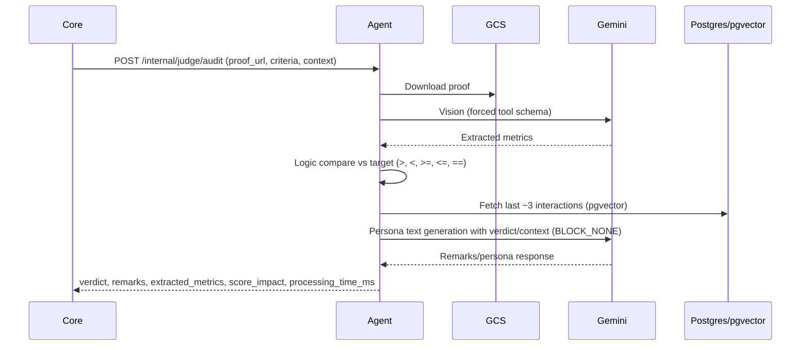

# Agent Technical Architecture (FastAPI + LangGraph)

Source alignment: `docs/prd/agent_prd.md`, `docs/prd_summary.md`.

Stack & Versions
- Python 3.11
- FastAPI ^0.110.0 + Uvicorn ^0.27.1 (ASGI)
- LangGraph ^0.0.33 (DAG orchestration)
- Gemini via langchain-google-vertexai ^1.0.3 and/or google-genai ^0.3.0
- SQLModel ^0.0.16 + psycopg[binary] ^3.1.18 + pgvector ^0.2.3 (Cloud SQL Postgres with vector)
- httpx ^0.27.0 (HTTP client), python-dotenv ^1.0.1

Infra
- Cloud Run (single env first), region `us-central1`
- DB: same Cloud SQL Postgres instance; pgvector enabled
- Storage: GCS `iron-will-proofs` for proof images
- Service account: Vertex AI User, Storage Object Viewer, Cloud SQL Client, Secret Manager Accessor
- Secrets: internal secret for Java→Agent, DB password, OAuth client secret (not used here), Gemini project/region/model

API Contract (Java → Agent)
- Endpoint: `POST /internal/judge/audit`
- Header: `X-Internal-Secret`
- Request: request_id, user_id, goal_id, timezone, proof_url (gs://...), criteria {metric, operator, target}, goal_context {title, description?}, user_context_summary?
- Response: verdict PASS/FAIL, remarks (persona), extracted_metrics {primary_value, app_name?, date_detected?, secondary_text?, is_fraudulent?}, score_impact, confidence?, processing_time_ms
- Error handling: 500 → caller treats as technical difficulty (no penalty); 400 → immediate reject

Cognitive Pipeline (LangGraph)
- VisualCortex: download GCS image; Gemini 2.5 Flash (vision) with forced tool schema → ExtractMetrics
- LogicGate: pure Python compare vs target (>, <, >=, <=, ==); parse times/percents; default FAIL on unreadable
- MemoryRecall: pgvector fetch last ~3 interactions for context (latency target <200ms)
- VoiceSynthesizer: Gemini text with “Iron Judge” persona; safety BLOCK_NONE
- Flow: Vision → Logic → Memory → Voice; returns structured response to core

Sequence (expected)
1) Download proof from GCS (httpx or gcs client).
2) Vision: Gemini forced-tool call returns structured metrics.
3) Logic: parse + compare vs contract criteria; set verdict; handle null/blur = FAIL.
4) Memory: fetch recent interactions (user_id) from pgvector; include in prompt context.
5) Voice: Gemini text with persona; return remarks + metrics; set score_impact (from core rules or provided).
6) Respond to Java; log processing time; on vision/LLM errors, return 500 (core will treat as no-penalty).

Security
- Enforce `X-Internal-Secret` on `/internal/judge/audit`
- No public endpoints beyond `/health`

Validation & Safety
- Force tool choice in Gemini vision to return schema; reject incomplete data as FAIL with “Evidence Unreadable”.
- Safety: BLOCK_NONE per PRD; persona is intentionally strict.

Observability & Ops
- JSON logs; request ID propagation recommended
- Optional per-route rate limit (token bucket)
- Health: `/health`

Config / Env (agent)
- APP_PORT (default 8081)
- GCP_PROJECT, GCS_BUCKET
- DB_URL (SQLModel/psycopg), DB_USERNAME/DB_PASSWORD if not in URL
- AGENT_INTERNAL_SECRET
- GEMINI_PROJECT (fallback GCP_PROJECT), GEMINI_LOCATION (`us-central1`), GEMINI_MODEL (`gemini-2.5-flash-lite-preview`)
- RATE_LIMIT_PER_MIN (optional)

Deployment
- Cloud Run with agent service account (roles above); connects to Cloud SQL and GCS; Vertex AI enabled in project
- Region aligned with core (`us-central1`)

Next Code Steps
- Implement GCS fetch utility (base64) and error handling
- Define Pydantic schemas for forced-tool extraction and response
- Wire LangGraph nodes (Vision, Logic, Memory, Voice) with deterministic LogicGate and persona prompt
- Add pgvector-backed memory store (fetch/save interactions)
- Add rate limiting middleware (optional) and structured logging

Data Schemas (Pydantic shapes)
- AuditRequest: request_id, user_id, goal_id, timezone, proof_url, criteria {metric, operator, target}, goal_context {title, description?}, user_context_summary?
- ExtractedMetrics: primary_value (float?), app_name?, date_detected?, secondary_text?, is_fraudulent?
- AuditResponse: verdict PASS/FAIL, remarks, extracted_metrics, score_impact, confidence?, processing_time_ms

Sequence Diagram (agent processing)

Config Matrix (agent)
- Port: `APP_PORT`
- DB: `DB_URL` (or DB_USERNAME/DB_PASSWORD)
- Storage: `GCS_BUCKET`
- Project/Region: `GCP_PROJECT`, `GEMINI_PROJECT` (fallback), `GEMINI_LOCATION` (`us-central1`)
- Model: `GEMINI_MODEL` (`gemini-2.5-flash-lite-preview`)
- Security: `AGENT_INTERNAL_SECRET`
- Rate limit: `RATE_LIMIT_PER_MIN` (optional)

Testing considerations
- Mock Gemini for unit/integration (return fixed metrics/remarks).
- Provide a small fixture set of proof images (pass/fail) for sanity.
- Use a local Postgres or test DB; disable pgvector calls in unit tests via feature flag.

