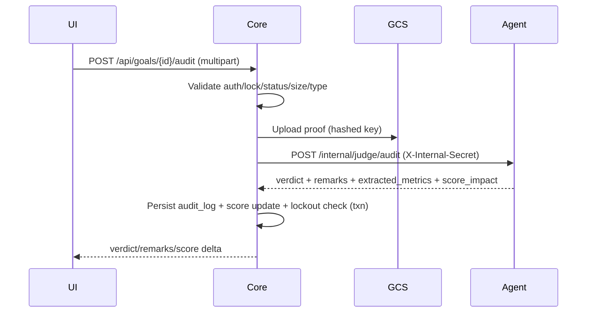

# Core / Backend Technical Architecture (Spring Boot)

Source alignment: `docs/prd/core_platform_prd.md`, `docs/prd_summary.md`.

Stack & Versions
- Java 17 (LTS, Cloud Run compatible)
- Spring Boot 3.2.5 (Spring Security 6, Web, Data JPA, Validation)
- Build: Gradle (Kotlin DSL)
- DB: Cloud SQL Postgres (instance `iron-will-sql`), pgvector enabled
- Storage: GCS `iron-will-proofs` (60+ day delete)
- Infra: Cloud Run (single env first, region `us-central1`)
- Auth: email/password + Google OAuth2 (Spring Security)
- Docs: springdoc-openapi 2.5.0

Service Responsibilities
- System of record: users, roles, goals (contracts), audits, notifications.
- Proof intake: multipart upload → GCS → synchronous Agent call → verdict + score update.
- Scoring/lockout: +0.5 pass, -0.2 fail, -1.0 missed; lock all active goals if score <3 for 24h (UI read-only during lockout).
- Timezone handling: client sends timezone each login; scheduler uses it for deadlines and nagging.
- Notifications: scheduler every 15m inserts unread items; frontend polls every 60s.
- Security & roles: USER/ADMIN; internal secret for Java→Agent; CORS; upload constraints.

Primary Responsibilities
- System of record: users, roles, goals (contracts), audits, notifications.
- Proof intake: multipart upload → GCS → synchronous Agent call → verdict + score update.
- Scoring/lockout: +0.5 pass, -0.2 fail, -1.0 missed; lock all active goals if score <3 for 24h (UI read-only during lockout).
- Timezone handling: client sends timezone each login; scheduler uses it for deadlines and nagging.
- Notifications: scheduler every 15m inserts unread items; frontend polls every 60s.

Data Model (per PRD)
- users: id UUID, email (unique), full_name, timezone, accountability_score DECIMAL(4,2), created_at, updated_at.
- goals: id UUID, user_id FK, title, review_time (stored UTC), frequency_type (DAILY), criteria_config JSONB, status (ACTIVE/LOCKED/ARCHIVED), locked_until, timestamps.
- audit_logs: id UUID, goal_id FK, audit_date, proof_url, status (PENDING/VERIFIED/REJECTED/MISSED), agent_remarks, score_impact DECIMAL(4,2), submitted_at; unique (goal_id, audit_date).
- notifications: id UUID, user_id FK, message, is_read, created_at.

APIs (planned)
- Auth: `/auth/login` (credentials), `/auth/google/callback`, `/auth/me`.
- User: `PUT /api/user/timezone`.
- Goals: `GET/POST/PUT /api/goals`, filter by status.
- Audit: `POST /api/goals/{id}/audit` (multipart, enforces score/lock, uploads to GCS, calls Agent, writes audit + score).
- Notifications: `GET /api/notifications/unread`.
- Internal Agent call: `POST /internal/agent/audit` (Java → Agent) with `X-Internal-Secret`.

Key Flows (sequence)
- Audit submission: auth check → lock/score check → file type/size check → GCS upload (hashed key) → Agent call (30s timeout) → persist audit & score → lockout check → respond verdict/remarks.
- Lockout: on any score update, if score <3 → set all ACTIVE goals LOCKED, locked_until = now+24h; UI read-only during lockout.
- Notifications: cron 15m finds past-due (TZ-aware) goals with no audit today; inserts notifications; frontend polls 60s.

Java → Agent Contract (unified)
- Request: request_id, user_id, goal_id, timezone, proof_url, criteria {metric, operator, target}, goal_context {title, description?}, user_context_summary?.
- Response: verdict PASS/FAIL, remarks, extracted_metrics, score_impact, confidence?, processing_time_ms.
- Errors: 500 = technical difficulty (no penalty); 400 = immediate reject.

Security & Roles
- Roles: ROLE_USER, ROLE_ADMIN (admin manages contracts/users, views audits).
- Session/JWT signing secret (Secret Manager).
- Google OAuth client ID/secret (Secret Manager).
- CORS: allow `http://localhost:3000` and future web Cloud Run host.
- Upload guard: JPG/PNG, max 5MB (config `MAX_UPLOAD_MB`).

Persistence & Transactions
- JPA with UUID PKs; unique constraint on (goal_id, audit_date) for audit_logs.
- Score + audit + lockout updates should run in a single transaction to keep state consistent.

Scheduling
- Nag job every 15m to find users past review_time (local TZ) with no audit today; insert notifications; avoid night hours (configurable).
- Lockout expiry: unlock after 24h; score remains low.

Observability & Ops
- JSON logs; request ID filter; optional rate limiting.
- Health: `/health` (present); actuator can be enabled for runtime checks.
- Deploy: Cloud Run with core service account (Storage Admin, Cloud SQL Client, Secret Manager).

Configuration / Env (core)
- DB_URL, DB_USERNAME, DB_PASSWORD
- GCP_PROJECT, GCS_BUCKET
- AGENT_BASE_URL, AGENT_INTERNAL_SECRET
- JWT_SECRET
- OAUTH_GOOGLE_CLIENT_ID, OAUTH_GOOGLE_CLIENT_SECRET
- MAX_UPLOAD_MB (default 5)
- CORS origins list

Security Hardening
- Enforce HTTPS (Cloud Run), httpOnly cookies/JWT, HSTS at ingress.
- Validate content-type/size on upload; reject non-image.
- Internal secret required for Agent; do not expose endpoint publicly.

Local Dev Strategy
- Use local Postgres or Cloud SQL public IP with SSL.
- Mock Agent locally to iterate UI without Vertex costs.
- Seed admin user and one sample goal/criteria for quick testing.

Open Items / Next Code Steps
- Add entities/repos for user/role/goal/audit/notification.
- Wire auth (credentials + Google), timezone controller, goal CRUD, audit orchestrator, notification polling, scheduler, score/lockout service, GCS upload service, Agent client with timeout.

Database Schema (DDL snippets)
```sql
CREATE TABLE users (
  id UUID PRIMARY KEY,
  email VARCHAR(255) UNIQUE NOT NULL,
  full_name VARCHAR(100),
  timezone VARCHAR(50) NOT NULL,
  accountability_score DECIMAL(4,2) DEFAULT 5.00,
  created_at TIMESTAMP DEFAULT CURRENT_TIMESTAMP,
  updated_at TIMESTAMP DEFAULT CURRENT_TIMESTAMP
);
CREATE INDEX idx_users_timezone ON users(timezone);

CREATE TABLE goals (
  id UUID PRIMARY KEY,
  user_id UUID REFERENCES users(id) ON DELETE CASCADE,
  title VARCHAR(255) NOT NULL,
  review_time TIME NOT NULL, -- stored UTC
  frequency_type VARCHAR(20) DEFAULT 'DAILY',
  criteria_config JSONB NOT NULL,
  status VARCHAR(20) DEFAULT 'ACTIVE', -- ACTIVE|LOCKED|ARCHIVED
  locked_until TIMESTAMP,
  created_at TIMESTAMP DEFAULT CURRENT_TIMESTAMP,
  updated_at TIMESTAMP DEFAULT CURRENT_TIMESTAMP
);
CREATE INDEX idx_goals_user_status ON goals(user_id, status);

CREATE TABLE audit_logs (
  id UUID PRIMARY KEY,
  goal_id UUID REFERENCES goals(id),
  audit_date DATE NOT NULL,
  proof_url TEXT,
  status VARCHAR(20) DEFAULT 'PENDING', -- PENDING|VERIFIED|REJECTED|MISSED
  agent_remarks TEXT,
  score_impact DECIMAL(4,2),
  submitted_at TIMESTAMP,
  UNIQUE (goal_id, audit_date)
);
CREATE INDEX idx_audit_logs_date ON audit_logs(audit_date);

CREATE TABLE notifications (
  id UUID PRIMARY KEY,
  user_id UUID REFERENCES users(id) ON DELETE CASCADE,
  message TEXT NOT NULL,
  is_read BOOLEAN DEFAULT FALSE,
  created_at TIMESTAMP DEFAULT CURRENT_TIMESTAMP
);
CREATE INDEX idx_notifications_user_unread ON notifications(user_id, is_read);
```

Sequence Diagram (audit submission)


Config Matrix (key envs)
- DB: `DB_URL`, `DB_USERNAME`, `DB_PASSWORD`
- Storage: `GCS_BUCKET`, `GCP_PROJECT`
- Agent: `AGENT_BASE_URL`, `AGENT_INTERNAL_SECRET`
- Auth: `JWT_SECRET`, `OAUTH_GOOGLE_CLIENT_ID`, `OAUTH_GOOGLE_CLIENT_SECRET`
- Upload: `MAX_UPLOAD_MB` (default 5)
- CORS: `app.cors.allowed-origins` list


