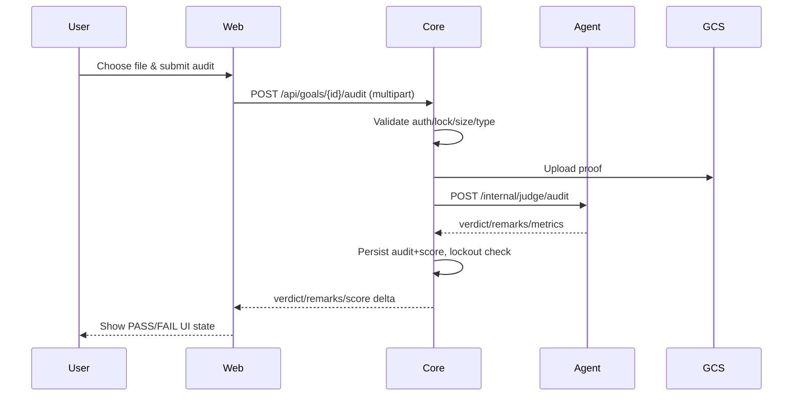

# Frontend Technical Architecture (Next.js)

Source alignment: `docs/prd/ui_framework_prd.md`, `docs/prd_summary.md`, stitched HTML prototypes in `stitch_accountability_health_tracker/*/code.html`.

Stack & Versions
- Next.js 14.1.0 (App Router), React 18.2
- TypeScript 5.3.3
- Tailwind CSS 3.3.5 + clsx/tailwind-merge
- Zustand 4.5.0 (client state: auth/score/lockout)
- @tanstack/react-query 5.17.0 (server state: goals, audits, notifications; polling at 60s)
- Framer Motion 11.0.0 (animations); React Three Fiber optional for avatar

Design System (per PRD)
- Command-interface aesthetic: dark/charcoal backgrounds, neon green energy, crimson for error/lockout, global scanlines/glow/glassmorphism.
- Typography: sans (Space Grotesk/Inter/Geist), mono for metrics.
- Prototypes mapped: login/gateway, dashboard HUD (score bar + avatar), contract config (time dial, criteria blocks), auditor (dropzone → analyzing laser → verdict), lockout (full-screen red glitch).

Information Architecture & Routing
- `/login`: Google + email/password; shows “SYSTEM STATUS: ONLINE_”.
- `/dashboard`: protected; score bar, avatar, goal list/cards, upload CTA, notifications badge.
- `/contract`: mission-style create/edit; time dial, criteria blocks.
- `/lockout`: read-only countdown/status when score <3; disabled controls.
- `/`: redirect to `/login` or `/dashboard` based on session.

Data Flows
- Auth: call core `/auth/login` (credentials) and Google OAuth flow (redirect to core). Session via httpOnly cookie/JWT from core.
- Goals: list/create/update via core `/api/goals`; show review time in local TZ (core stores UTC).
- Audit upload: multipart to core `/api/goals/{id}/audit`; UI states Idle → Uploading → Analyzing (while Agent verdict pending) → Result (PASS/FAIL).
- Notifications: poll `/api/notifications/unread` every 60s; show badge/toast.
- Lockout: if score <3, redirect to `/lockout`; allow read-only status/countdown.

State & Caching
- Zustand: auth (user, token), score/lockout flag, minimal UI flags.
- React Query: goals, notifications, audit mutations; polling interval 60s; retries on transient errors.

Styling & UX
- Tailwind theme matches PRD colors; global scanlines/glow; focus-visible rings for accessibility.
- Avoid color-only signals: include text badges for statuses (PENDING/DONE/FAILED/LOCKED).
- Optional reduced motion toggle if time permits.

Components (planned)
- UI atoms: BioButton, GlassCard, NeonBadge, focus-visible inputs.
- Features: ScoreBar (liquid neon), GoalCard (status badge), AuditScanner (dropzone/analyze/verdict), TimeDial (safe-dial), NotificationBadge/Toast.
- Canvas (optional): AgentSphere (React Three Fiber), feature-gated via env.

Config / Env (web)
- `NEXT_PUBLIC_API_BASE_URL` -> core URL (local `http://localhost:8080`; Cloud Run host later).
- `NEXT_PUBLIC_POLL_INTERVAL_MS` (default 60000).
- `NEXT_PUBLIC_ENABLE_CANVAS_AVATAR` (feature toggle).

Security
- CORS handled in core; frontend calls only allowed origins.
- Use httpOnly cookies for session/JWT; avoid storing tokens in localStorage.
- Validate upload size/type client-side (JPG/PNG <= 5MB) before sending to core.

Deployment
- Containerized Next.js on Cloud Run in `us-central1`; set `NEXT_PUBLIC_API_BASE_URL` to core service URL.
- Add frontend origin to core CORS allowlist.

Next Code Steps
- Implement auth client (credentials + Google redirect), protected layouts.
- Build real components from prototypes: ScoreBar, GoalCard, AuditScanner, TimeDial, Lockout overlay.
- Wire React Query hooks to core endpoints; add polling for notifications; redirect on lockout flag.
- Apply theme utilities (scanlines/glow) in `globals.css`; finalize Tailwind config with semantic tokens.

Sequence Diagram (audit upload happy path)

Config Matrix (web)
- `NEXT_PUBLIC_API_BASE_URL`: core base URL (dev `http://localhost:8080`)
- `NEXT_PUBLIC_POLL_INTERVAL_MS`: default 60000
- `NEXT_PUBLIC_ENABLE_CANVAS_AVATAR`: feature toggle for AgentSphere

Testing considerations
- Mock core endpoints for UI development to avoid backend dependency.
- Use MSW or similar to stub `/api/goals`, `/api/notifications/unread`, `/api/goals/{id}/audit`.
- Validate client-side file constraints (type/size) before POST.

